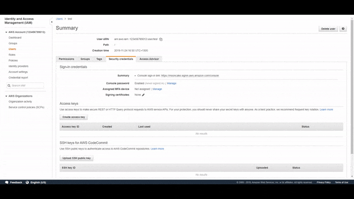
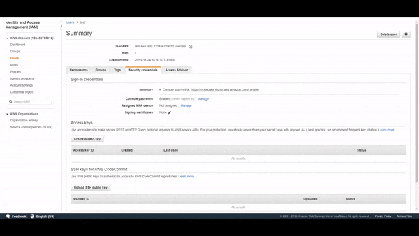

# AWS MFA Entity Already Exists Fix

This fixes the error that can occur when an IAM user tries to create an MFA device and they click cancel or the session times out.
The MFA device is still assigned to the user but not synced properly. So when the user tries to create another virtual MFA device it fails
with the error Entity Already Exists. You can see a demonstration of the error occurring below.

The Cloudformation template installs a lambda and a cloudwatch event that listens for this error occuring and deletes the 
MFA device. Meaning that the user can quickly recreate their MFA device. You can see it working below.

## Installation

You can launch this solution yourself using this link .

By default this will launch the stack in us-east-1. It needs to be deployed there or else it wont recevie the event from Cloudwatch. 
This is due to IAM living in us-east-1.

The Cloudformation template builds a lambda function and a cloudwatch event that triggers the lambda function. Read 
the [cloudformation template](./template.yml) for the full list of resources it creates.

## Things to note

- This does not break when a user creates an MFA device correctly. The cloudwatch event specifically listens for the error and only
runs the program when the specific error occurs.
- The lambda only occurs when the error runs. So the user needs to trigger the error for it to work. Normally users will just 
try it again.
- This does not delete the MFA device if the user is wanting to resync their MFA device etc.
- It takes  about 5 - 10 seconds after the user triggers the error for the lambda to do its magic. 
- The only way that you could trigger this accidentally is if you made the API call directly while you already
had a working MFA device but that seems unlikely.
- This application assumes users can only create MFA devices for themselves as if not another user could maliciously 
make the create-virtual-mfa-device call and trigger this on another user.
- I have noticed that in some accounts this error doesn't occur as it seems to do this on it's own.

## Contributing

Pull requests are welcome. For major changes, please open an issue first to discuss what you would like to change.

If you change handler.py please update the Cloudformation template accordingly.

Please make sure to update tests as appropriate.

## License

[MIT](https://choosealicense.com/licenses/mit/)